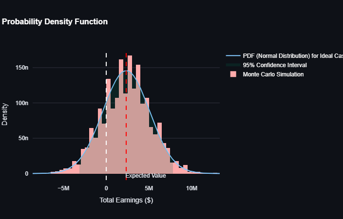
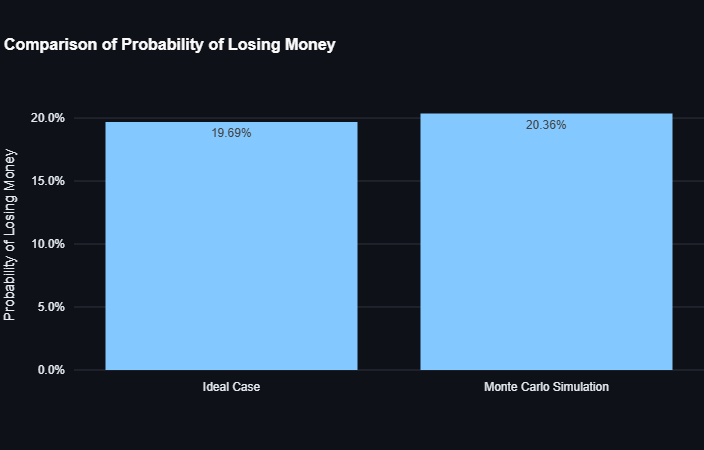
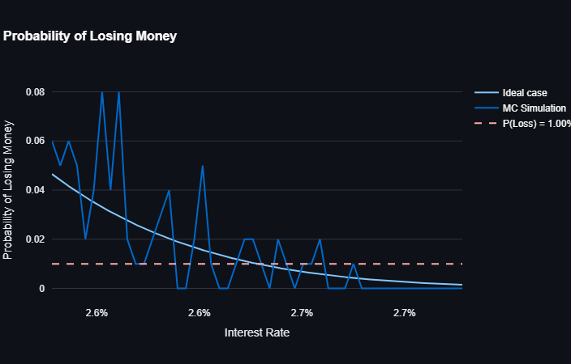

# Loan Risk Analysis Dashboard
You can try this dashboard online [here](https://hamidabbasi-r-loan-risk-analysis-loan-risk-analysis-iumesf.streamlit.app/).
This repository contains a Streamlit-based dashboard for analyzing the risk of losing money on a loan portfolio. The dashboard provides both theoretical calculations and Monte Carlo simulations to estimate the probability of financial loss under various scenarios.

## Features

- **Probability of Losing Money**: Calculate the probability of losing money based on the number of loans, loan amount, interest rate, and default probability.
- **Monte Carlo Simulation**: Simulate multiple scenarios where the default rate may change, providing a more realistic assessment of risk.
- **Interest Rate Optimization**: Determine the optimal interest rate required to achieve a desired probability of losing money.
- **Interactive Visualizations**: Explore the results through interactive plots including Probability Density Functions (PDFs), bar charts, and line graphs.

## Installation

1. Clone this repository:
   ```bash
   git clone https://github.com/HamidAbbasi-R/Loan-Risk-Analysis.git
   cd Loan-Risk-Analysis
   ```

2. Install the required dependencies:
   ```bash
   pip install -r requirements.txt
   ```

3. Run the Streamlit app:
   ```bash
   streamlit run app.py
   ```

## Usage

### Input Parameters

Adjust the following parameters in the sidebar to customize your analysis:

- **Number of Loans (N)**: Total number of loans in the portfolio.
- **Loan Amount**: The principal amount of each loan.
- **Loss per Foreclosure**: Financial loss incurred if a loan defaults.
- **Interest Rate (r%)**: Annual interest rate applied to the loans.
- **Probability of Default (%)**: Likelihood that a borrower will default on their loan.
- **Desired Probability of Losing Money (%)**: Target probability of losing money, used to find the optimal interest rate.
- **Monte Carlo Simulation Settings**:
  - **Number of Paths**: Number of simulated scenarios.
  - **Probability of Default Changing**: Chance that the default rate changes during the simulation.
  - **Percentage Change in Default Amount**: Magnitude of change in the default rate if it changes.
  - **Probability of Default Changing Up**: Likelihood that the default rate increases rather than decreases.

### Output

The dashboard provides several outputs:

1. **Probability Density Function (PDF)**: Displays the distribution of total earnings, highlighting the expected value and confidence intervals.
2. **Comparison Chart**: Compares the probability of losing money between the ideal case and the Monte Carlo simulation.
3. **Interest Rate vs. Probability of Losing Money**: Shows how the probability of losing money varies with different interest rates, helping identify the optimal rate for a given target probability.

## Example
For this input variables, the results are shown below:

| Parameter  | Value |
| ------------- | ------------- |
| Number of Loans  | 10,000 |
| Loan Amount   | $180,000  |
| Loss per Foreclosure | $200,000  |
| Interest Rate | 2.4% |
| Default Rate | 2.0% |
| Desired Probability of Losing Money | 1.0% |
| Monte Carlo Simulation Paths | 5,000 |
| Probability of Default Changing | 0.0% |
| Percentage Change in Default Amount (if it changes)| 0.0% |
| Probability of Default Changing Up (if it changes) | 50.0% |


The distribution of earnings is displayed below.

The dashboard also shows the difference between theoretical calculations and Monte Carlo simulations in terms of probability of losing money.

Finally, the optimal interest rate required to achieve a 1% probability of losing money is calculated based on both theoretical and Monte Carlo results.



## Contributing

Contributions are welcome! Please feel free to submit a Pull Request or open an issue for any improvements or bug fixes.